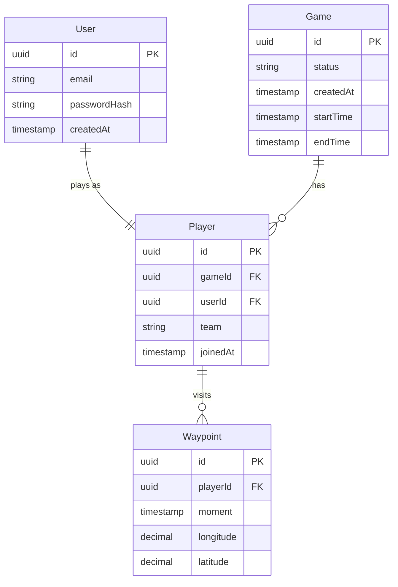

```mermaid
erDiagram
User {
    uuid id PK
    string email
    string passwordHash
    timestamp createdAt
}

Player {
    uuid id PK
    uuid gameId FK
    uuid userId FK
    string team
    timestamp joinedAt
}

Waypoint {
    uuid id PK
    uuid playerId FK
    timestamp moment
    decimal longitude
    decimal latitude
}

Game {
    uuid id PK
    string status
    timestamp createdAt
    timestamp startTime
    timestamp endTime
}

User ||--|| Player : "plays as"
Game ||--o{ Player : "has"
Player ||--o{ Waypoint : "visits"
```
